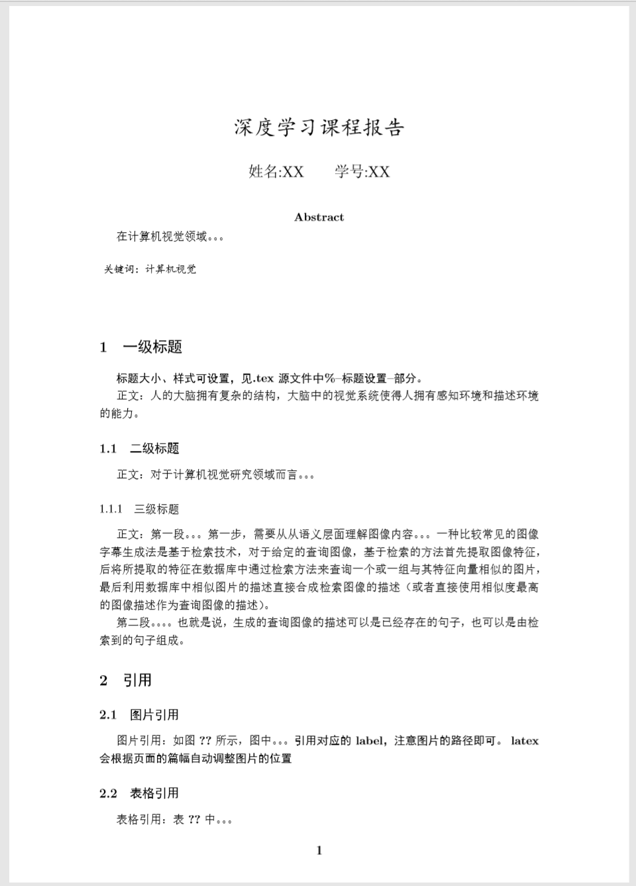

# Latex-template
latex中文模板，生成的->[pdf](https://github.com/helloMickey/Latex-template/blob/master/template.pdf)。主要记录latex一些常用的操作，持续更新。。

效果如下图：

    

# 注意
.bib文件需要通过xelatex->bibtex->xelatex->xelatex 编译方式，tex文件中的引用才会正常显示（编译不通过会显示 [?]）。
例如，使用VScode作为编辑器时，再setting.json中需要设置

    "latex-workshop.latex.recipes": [
        {
        "name": "xe->bib->xe->xe",
        "tools": [
            "xelatex",
            "bibtex",
            "xelatex",
            "xelatex"
            ]
        }
    ]
## 其他模板资源:
[IEEE transaction templates](https://journals.ieeeauthorcenter.ieee.org/create-your-ieee-article/authoring-tools-and-templates/ieee-article-templates/templates-for-transactions/)
